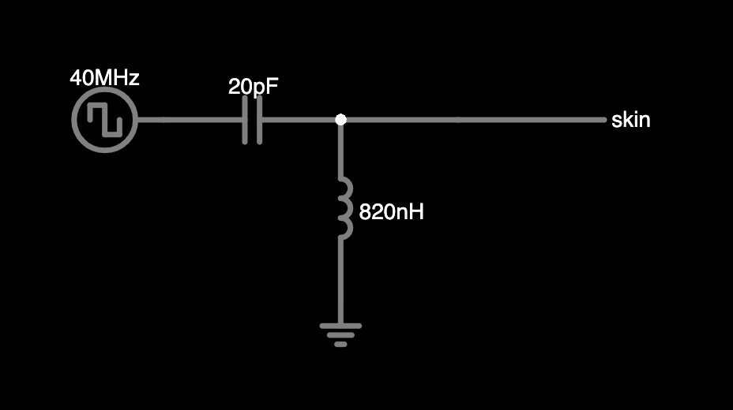

# Hi, welcome to the Power-over-Skin Repo

This repository contains the PCB files for the receiver board from the ACM UIST paper ["Power-over-Skin: Full-Body Wearables Powered By Intra-Body RF Energy"](https://dl.acm.org/doi/10.1145/3654777.3676394)

# BOM for receiver
You can assume all parts are generic unless mentioned below:

- R1-R7: Voltage setting resistors, should be 1% or better

- L2, L3: buck/boost inductors for the BQ25570. Should handle >200mA saturation current according to BQ25570 datasheet, but we're using low currents so you would probably get away with lower values. We used CB2518T100K and BRC2518T220K

- C4: Anything >100uF will do. I'm using the F950J107MPAAQ2, it is the only one that's quite so small, but it's also very DC-leaky

- L1: Should have a self-resonant frequency over 200 MHz in order to accomodate incoming square wave harmonics. 
- C9: Should be NP0, with a Vmax 10V or better

# Transmitter
In our experiments, we used a benchtop transmitter and a wearable one to generate 40 MHz square waves. These were passed through an impedance-matching network to couple into the body. The values we used were: first 20pF in series, then 820nH to ground. The 20pF should be NP0 with a voltage rating higher than the 40MHz you're sending into it. We used this inductor ((L-15FR82JV4E))[https://www.mouser.com/ProductDetail/Johanson-Technology/L-15FR82JV4E?qs=N%252Bgu1CRRfTPf9IhMOTDbHA%3D%3D] but anything with a self-resonant frequency >200 MHz should work. 

# Matching for other frequencies
The RF component values are all tuned for 40 MHz and human skin impedance — if you'd like to use another frequency, you'll have to resimulate the circuit. 

# Further questions?
Feel free to email Andy with any questions
